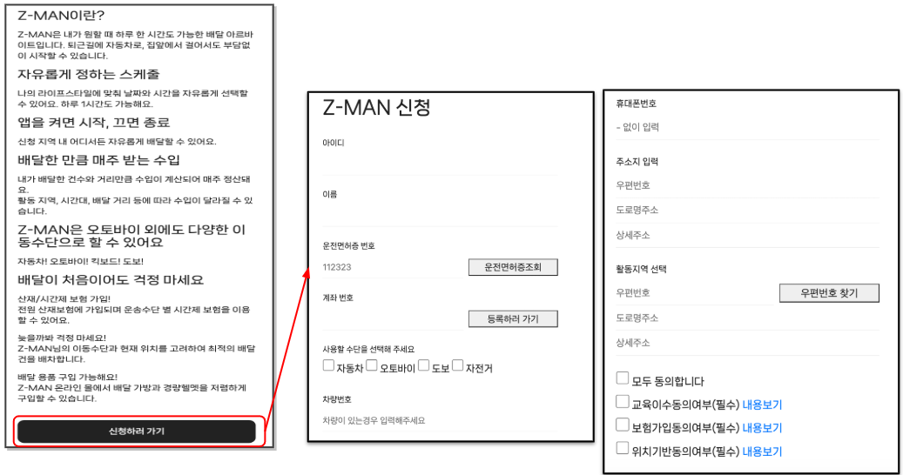

# ZERO – 중고 거래 & 경매 플랫폼

> 사용자들이 중고 상품을 거래, 경매, 배송 추적까지 가능한 웹 애플리케이션입니다.

---

### 📌 자료
- **PPT 보기:** [ZERO_PPT.pdf](docs/ZERO.pdf)  

---

## 회원가입

### 화면 예시

- **기능**:
  - **정규식**: 이름, 이메일주소, 휴대폰번호 입력 시 유효성 검사
  - **중복검사(AJAX)**: 닉네임, 이메일주소, 휴대폰번호의 중복 여부를 실시간으로 확인

---

### 정확하지 않을 시

- **기능**:
  - 유효하지 않은 정보 입력 시 **빨간색 오류 메시지**로 사용자에게 알려줍니다.

---

### 정확할 시

- **기능**:
  - 유효한 정보 입력 시, **정상적으로 회원가입 완료** 메시지가 나타납니다.

---

## 마이페이지

### 화면 예시
 
- <strong>기능</strong>: <strong>메인 화면</strong>에서는 최신순 3개 목록을 표시합니다.  

 
- <strong>기능</strong>: <strong>경매 목록</strong>과 관련된 페이지입니다.  

 
- <strong>기능</strong>: <strong>구매내역</strong>과 <strong>리뷰 작성</strong> 페이지로, 사용자가 작성한 리뷰를 확인할 수 있습니다.  

 
- <strong>기능</strong>: <strong>리뷰 작성, 삭제</strong> 기능을 제공하며, <strong>AJAX</strong>로 실시간 업데이트됩니다.  

---

## Z-MAN 신청

### 화면 예시

- **기능**:
  - 기존 회원은 Z-MAN 신청 페이지를 통해 **Z-MAN 신청**이 가능합니다.
  - **자동차** 및 **오토바이**를 이용할 경우, **운전면허증** 등의 추가적인 정보 입력이 필요합니다.
  - 신청 후, **"대기"** 상태로 변경되고, **관리자 승인 후** "활동" 상태로 변경됩니다.

---

### 🛠 프로젝트 개요
- **기간:** 2023‑07‑12 ~ 2023‑08‑17  
- **팀 구성:** 7명 (부산 ITWILL 교육센터 팀 프로젝트)  

### 🔧 기술 스택
- **언어**: Java, JSP, HTML, CSS, JavaScript  
- **프레임워크/라이브러리**: Spring, MyBatis, jQuery, AJAX, Bootstrap  
- **서버/DB**: Apache Tomcat, MySQL  
- **도구**: GitHub, Notion, Discord, Google Drive  

---

### 🎯 담당 역할
- **회원가입, 마이페이지 구현**  
- **이메일 인증, 문자 인증, 주소 검색 API 연동**  
- **CRUD 및 정규식 유효성 검사**  

---

### ✨ 회고 & 성과
> 두 번째이자 교육센터에서의 마지막 팀 프로젝트였다.  
> 첫 번째 프로젝트에서 배운 점들을 바탕으로 이번 프로젝트는 훨씬 더 나은 결과물을 만들 수 있었다.  
> 시간 부족으로 **공동 코드 작성**이 어려웠지만, 각자가 맡은 기능을 잘 구현하며 팀원들과 협력하여 프로젝트를 완성할 수 있었다.  
> 이 과정을 통해 **팀워크**와 **협업의 중요성**을 다시 한 번 실감할 수 있었고, **개선할 점**들을 많이 배울 수 있었다.  
> 앞으로의 개발 과정에서도 이번 경험을 바탕으로 더 나은 결과를 만들어 나가고 싶다.
